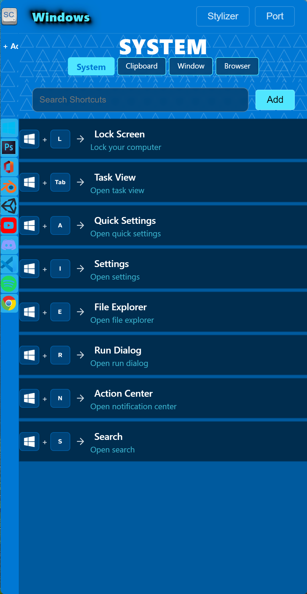
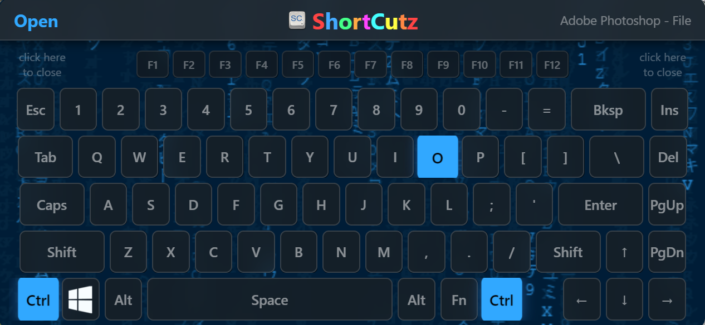
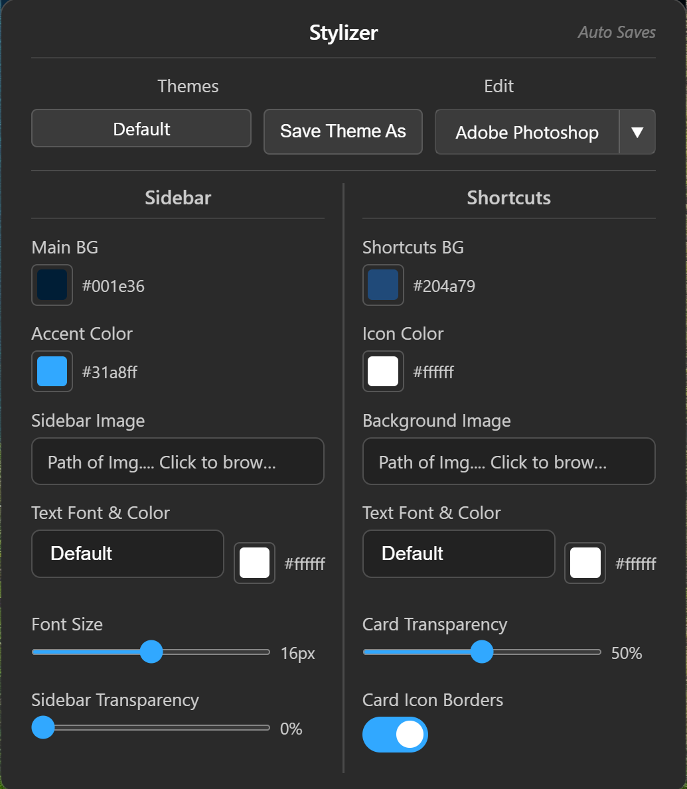
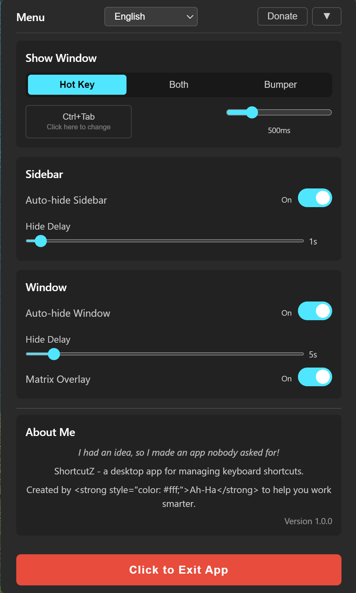

# ShortcutZ

A desktop keyboard shortcut manager built with Electron. Organize, view, and customize keyboard shortcuts for all your apps in one place.

## Features

- **Per-app shortcut management** — Add apps, assign keyboard shortcuts, and organize them into pages
- **Visual keyboard overlay** — On-screen keyboard shows which keys are pressed, with customizable icons per key
- **Theme system** — 15+ built-in themes (Discord, GitHub, Figma, macOS, etc.) plus fully customizable styles
- **Import/Export** — Share shortcut configs as `.cutz` files, import/export apps, pages and themes
- **Auto-hide sidebar** — Sidebar and window can auto-hide and reappear on hotkey
- **Multi-language support** — Localized UI (English, Spanish, French, German, Portuguese, Japanese, Korean, Chinese, Russian, and more)
- **Stylizer** — Customize background images, accent colors, sidebar images, fonts, transparency, and more per app
- **Keyboard icon customization** — Set custom icons per keyboard key, per shortcut, or per app
- **Keyboard backgrounds** — Set custom background images for the keyboard overlay
- **Backup & restore** — Full app backup to `.cutz` file with one click
- **Search** — Quickly search through shortcuts within any app
- **Zoom** — Adjustable zoom level
- **Global hotkey** — Toggle the window with a configurable hotkey
- **Auto-Detect** - When running app that you've added to ShortCutZ, pressing hotkeys should unhide to show current app page of shortcuts

## Screenshots

| Main View | Keyboard Overlay | Stylizer |
|-----------|-----------------|----------|
|  |  |  |

| Themes | Menu | Onboarding |
|--------|------|------------|
|  |  |  |

## Installation

### Download

Download the latest `ShortcutZ.exe` from the [Releases](https://github.com/s0l0r3b3l22/ShortCutZ/releases) page. No installation needed — it's a standalone executable.

## Usage

1. Launch `ShortcutZ.exe`
2. On first run, choose your a side and pick, Fresh (no apps or shortcuts) or Pre-made (Some Samples that can be changed/themed)
3. Add apps via the sidebar, then add shortcuts to each app
4. Click a shortcut card to see the keyboard overlay that highlights the keys used
5. Use the **Stylizer** to customize colors, backgrounds, fonts, and themes
6. Use the **Menu** (sidebar header icon) to access settings, backup, language, and exit

## Tech Stack

- **Electron** — Desktop framework
- **Vanilla JS** — No framework, pure JavaScript
- **Custom CSS** — Hand-crafted UI with theme support
- **Enigma Virtual Box** — Single-file exe packaging
- **active-win** — Detects the currently focused application

## License

[MIT](LICENSE) © 2026 s0l0r3b3l22
